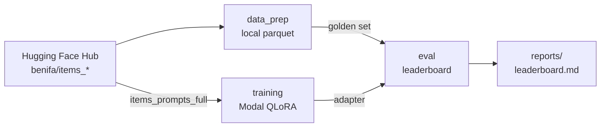
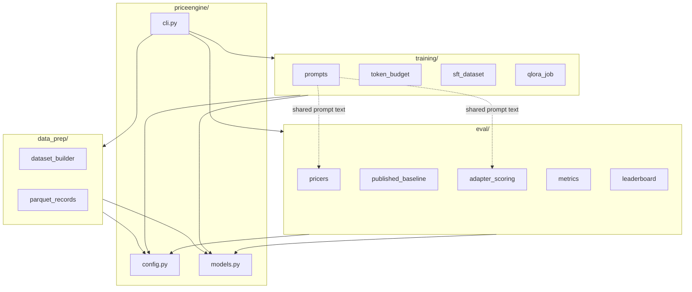

# Price Engine

Estimate an **Amazon list price** from a bare product description using a QLoRA
specialist on `meta-llama/Llama-3.2-3B`, then score it fairly against the published
checkpoint
[`ed-donner/price-2025-11-28`](https://huggingface.co/ed-donner/price-2025-11-28_18.47.07).

This is a research / portfolio pipeline — data prep, Modal training, and a
paired-bootstrap eval protocol — not a production pricing API.

## What it does



1. **Prepare** Amazon list-price rows from Hub → `data/splits/` + held-out golden set.
2. **Train** a LoRA that completes `Price is $NNN.00` (usually on Modal from Hub prompts).
3. **Evaluate** our adapter vs the published baseline on the **same** golden items,
   with MAE / hit-rate and a paired bootstrap victory test.

Labels are catalog **list** prices in **$1–$999** (rounded), not marketplace sold comps.

## Architecture



| Path | Role |
|------|------|
| `src/priceengine/cli.py` | Typer entrypoint (`prepare-list-prices`, `eval`, …) |
| `src/priceengine/config.py` | Paths, price bounds, prompt constants, victory thresholds |
| `src/priceengine/models.py` | Shared schemas (`ProductListing`, `EvalItem`, …) |
| `src/priceengine/data_prep/` | Hub → local train/val/golden parquet |
| `src/priceengine/training/` | Prompts, token budget, optional SFT build, Modal QLoRA |
| `src/priceengine/eval/` | Pricers, metrics, leaderboard, Modal scoring |
| `training/configs/list_price_qlora.yaml` | QLoRA hyperparameters (Colab full-mode recipe) |
| `docs/` | Design, comparison protocol, training notes, model card |

Raw data and adapters are **not** committed (see [`data/README.md`](data/README.md)).

## Prompt format

Every training and eval example uses the same shape:

```text
What does this cost to the nearest dollar?

<title + description>

Price is $
```

The model emits `NNN.00`. Loss during SFT is **completion-only** after `Price is $`.

## Quickstart

**Needs:** `HF_TOKEN` (gated Llama + Hub), a Modal account, and a deployed
`pricer-service` for the published baseline — or `--no-include-baseline` /
reuse `reports/leaderboard.json`.

```bash
uv sync --extra dev
cp .env.example .env   # HF_TOKEN=...

# 1) Golden set + local splits (from benifa/items_lite)
uv run priceengine prepare-list-prices --size lite

# 2) Train on Modal A100 (writes /data/checkpoints/list_price_qlora)
uv run modal run --detach src/priceengine/training/qlora_job.py \
  --config training/configs/list_price_qlora.yaml

# 3) Grade vs published baseline
# Older volume folder still named amazon_replica — label it with --name:
uv run priceengine eval --modal \
  --adapter-path /data/checkpoints/amazon_replica \
  --name list_price_qlora \
  --limit 100 --out reports/leaderboard.md
```

Optional helpers:

```bash
uv run priceengine token-budget          # CUTOFF histograms → reports/token_length/
uv run priceengine build-sft-dataset     # local splits → data/hf_dataset/
uv run priceengine eval-baselines        # CPU medians only
uv run priceengine visualize-eval        # Plotly HTML (truth vs guess) → browser
```

Dataset mirrors: `benifa/items_lite`, `benifa/items_full`. Exact training knobs:
[`docs/TRAINING.md`](docs/TRAINING.md).

## Victory criteria

On the Amazon golden set vs the published Modal baseline:

- Relative MAE improvement ≥ **25%**, **and**
- 95% paired-bootstrap CI on ΔMAE has lower bound **> 0**, **and**
- Beat the same-category train-median baseline

Full protocol: [`docs/COMPARISON.md`](docs/COMPARISON.md).

## Docs

| Doc | Contents |
|-----|----------|
| [Design](docs/DESIGN.md) | Architecture, data contracts, package boundaries |
| [Comparison](docs/COMPARISON.md) | Fair-eval rules and metrics |
| [Training](docs/TRAINING.md) | Colab-full replica hyperparameters |
| [Model card](docs/MODEL_CARD.md) | Intended use and results placeholder |

## License

MIT
