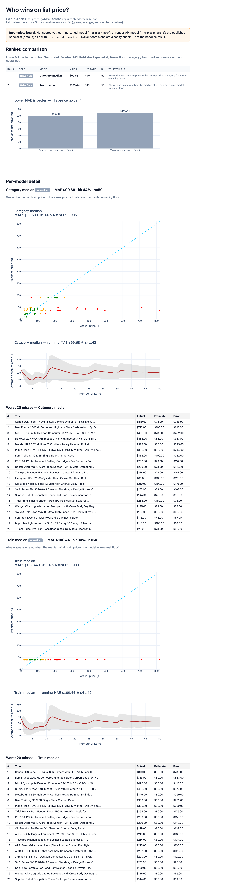

# Price Engine

Fine-tune and evaluate a model that predicts a product **list price** from its
title and description. Then publish the weights to Hugging Face.

1. Prepare data  
2. Fine-tune (QLoRA on Modal)  
3. Evaluate vs specialist + optional frontier (GPT-5)  
4. Publish a versioned Hub model  

Data today: Amazon list prices ($1–$999).

## Quickstart

```bash
uv sync --extra dev
cp .env.example .env   # HF_TOKEN=...  (OPENAI_API_KEY=... for --frontier)

uv run priceengine prepare-data --size lite

uv run modal run --detach src/priceengine/train/modal_train.py \
  --config configs/qlora.yaml

uv run priceengine eval --modal \
  --adapter-path /data/checkpoints/list_price_qlora \
  --name list_price_qlora --frontier gpt-5 --limit 100 --visualize \
  --out reports/leaderboard.md

uv run priceengine publish-model \
  --adapter-path ./adapters/list_price_qlora \
  --repo benifa/list-price-qlora --tag v0.1.0 --private
```

Needs `HF_TOKEN` + Modal (`OPENAI_API_KEY` + `uv sync --extra frontier` for GPT). See `uv run priceengine --help`.

## Eval report

`priceengine eval --visualize` writes a ranked HTML report (roles, MAE bars,
scatter, worst misses). The screenshot is from a real local run on 50 golden
items — naive floors only until you also score `--adapter-path` / `--frontier`:



## Prompt

```text
What does this cost to the nearest dollar?

<title + description>

Price is $
```

## Docs

[`DESIGN`](docs/DESIGN.md) · [`TRAINING`](docs/TRAINING.md) · [`EVAL`](docs/EVAL.md) ·
[`PUBLISH`](docs/PUBLISH.md) · [`MODEL_CARD`](docs/MODEL_CARD.md)

## License

MIT
