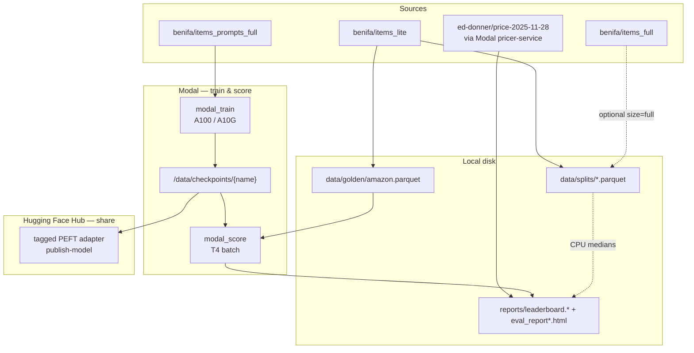

# Design — Price Engine

## Mission

Reproduce and improve on the published Amazon list-price QLoRA specialist
(`ed-donner/price-2025-11-28`) with a **fair**, paired-bootstrap eval on a held-out
Amazon golden set, then publish a **versioned** Hub adapter other apps can load.

This repo is a closed research loop:

**prepare data → train LoRA on Modal/HF → eval (+ HTML) → tag + publish to Hub**

It is not a marketplace scraper, production API, or Ollama fine-tune stack.

## Stack boundaries

| Layer | Technology | Artifact |
|-------|------------|----------|
| Data | Hugging Face datasets | `data/splits/`, `data/golden/` |
| Train | Modal + Transformers/PEFT QLoRA | `/data/checkpoints/list_price_qlora` |
| Eval | Local + Modal scoring | `reports/leaderboard.*`, `reports/eval_report*.html` |
| Share | Hub PEFT repo + revision tag | e.g. `benifa/list-price-qlora@v0.1.0` |

## System overview



## Package layout

```text
src/priceengine/
  config.py, models.py, prompts.py, cli.py
  data/          prepare.py, parquet.py
  train/         modal_train.py, local_sft.py, publish.py
  eval/          run.py, pricers.py, metrics.py, leaderboard.py,
                 baseline_pricer.py, modal_score.py, report_html.py
configs/
  qlora.yaml
```

| Module | Owns |
|--------|------|
| `cli.py` | Commands: prepare-data, build-local-sft, eval, publish-model |
| `config.py` / `models.py` / `prompts.py` | Shared knobs, DTOs, prompt text |
| `data/` | Hub → parquet splits + golden |
| `train/` | Modal QLoRA, optional local SFT build, Hub publish |
| `eval/` | Score, metrics, leaderboard, HTML |

## Stages

1. **Prepare** — Hub → `ProductListing` rows; golden = lite test; prices in [$1, $999].
2. **Train** — Modal QLoRA (Hub `items_prompts_full`, or local `build-local-sft` fallback).
3. **Eval** — medians + published baseline + our adapter; optional HTML via `--visualize`.
4. **Publish** — tagged PEFT adapter on Hub (`publish-model --tag vX.Y.Z`).

## Prompt contract

```text
What does this cost to the nearest dollar?

{title}
{description}

Price is $
```

Description truncated to `MAX_DESCRIPTION_TOKENS` (110). Training `max_seq_length` = 128.

## Out of scope

- Marketplace scrapers / sold comps
- RAG over comparable listings
- Production HTTP serving
- Ollama / GGUF export (not in this repo)

## Related docs

- [`EVAL.md`](EVAL.md) — eval commands, fair comparison, victory math
- [`TRAINING.md`](TRAINING.md) — hyperparameters and train loop
- [`PUBLISH.md`](PUBLISH.md) — Hub adapters
- [`MODEL_CARD.md`](MODEL_CARD.md) — intended use
