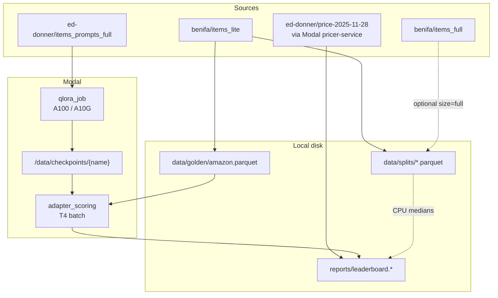
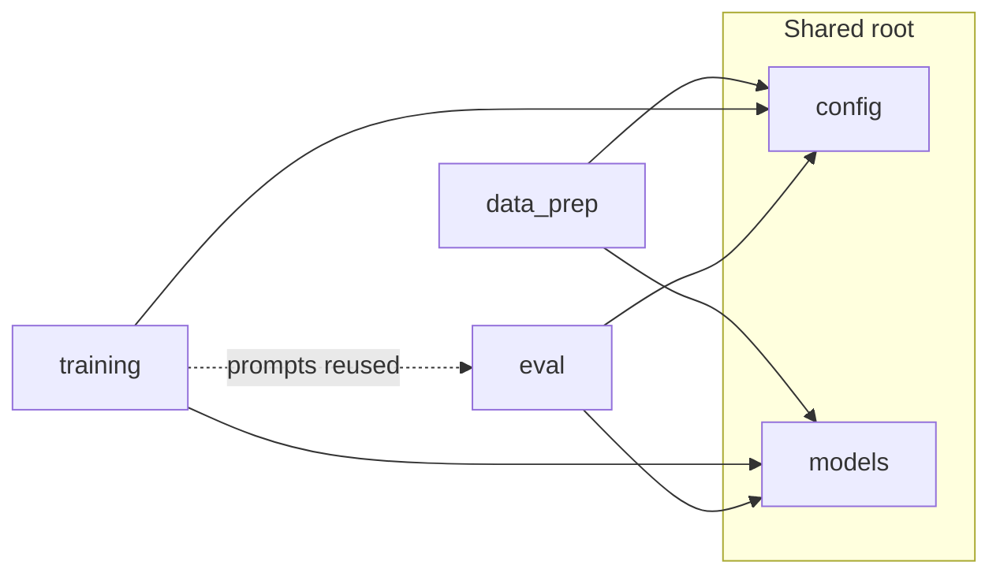
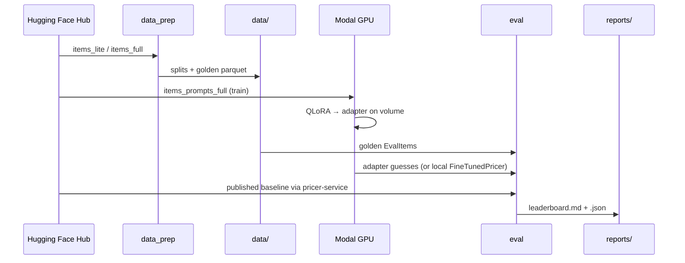

# Design — Price Engine

## Mission

Reproduce and improve on the published Amazon list-price QLoRA specialist
(`ed-donner/price-2025-11-28`) with a **fair**, paired-bootstrap eval on a held-out
Amazon golden set.

This repo is a closed research loop: prepare data → train LoRA → score on the same
items the baseline sees. It is not a marketplace scraper or a serving product.

## System overview



## Package boundaries

Cross-cutting types and knobs live at the package root so `data_prep`, `training`,
and `eval` do not depend on each other sideways:

| Module | Owns |
|--------|------|
| `cli.py` | User commands only (thin orchestration) |
| `config.py` | Paths, `$1–$999` bounds, prompt constants, victory thresholds |
| `models.py` | `ProductListing`, `EvalItem`, `Prediction`, metrics DTOs |
| `data_prep/` | Hub download → typed parquet on disk |
| `training/` | Prompt text, CUTOFF analysis, optional SFT build, Modal train job |
| `eval/` | Pricer adapters, metrics, leaderboard writers, Modal score jobs |



`training.prompts` is the single source of prompt/completion text. Eval imports it
so train and score never drift on format.

## End-to-end data flow



### Stage 1 — Data prep

- Hub rows → `ProductListing` (`list_price`, `item_id`, …).
- Prices clamped/rounded to **[$1, $999]** (Llama encodes those integers as one token).
- **lite:** keep publisher train/val/test; golden = lite test.
- **full:** subsample large train/val; golden still = lite test; those titles are
  **held out** of train/val so eval cannot leak.

### Stage 2 — Training

- Prompt format: question + product text + `Price is $` → completion `NNN.00`.
- Default replica loads Hub prompt/completion rows inside Modal (no local SFT build).
- Optional local path: `build-sft-dataset` from parquet splits → `data/hf_dataset/`.
- Loss is **completion-only** after the prefix (learn dollars, not the question).

### Stage 3 — Eval

Anything that maps `EvalItem → float` implements the `Pricer` protocol:

| Adapter | Where it runs |
|---------|----------------|
| `SameCategoryMedianPricer` / `OverallMedianPricer` | Local CPU (train medians) |
| `FineTunedPricer` | Local (macOS: no 4-bit) |
| `PublishedBaselinePricer` | Modal `pricer-service` |
| `adapter_scoring.price_batch` | Modal T4, our adapter on the volume |

Metrics and victory rules: [`COMPARISON.md`](COMPARISON.md).

## Prompt contract

```text
What does this cost to the nearest dollar?

{title}
{description}

Price is $
```

Description tokens are truncated to `SUMMARY_CUTOFF` (default **110**) before
wrapping so the question + prefix always fit. Training `max_seq_length` for the
replica is **128**.

**Published baseline caveat:** the remote `Pricer` wraps the description itself.
`PublishedBaselinePricer` therefore sends a truncated description only — not a
full prompt — to avoid doubling the question.

## On-disk layout

```text
data/
  splits/{train,val,test}.parquet   # ProductListing
  golden/amazon.parquet             # EvalItem (fair-eval set)
  combined/amazon.parquet           # optional union dump
  hf_dataset/                       # optional local SFT DatasetDict
reports/
  leaderboard*.md / .json
  amazon_prep.json
  token_length/                     # CUTOFF histograms
```

Nothing under `data/` or generated `reports/` is committed except READMEs.

## Design decisions

| Decision | Why |
|----------|-----|
| List prices, not sold comps | Matches the published specialist and Hub datasets |
| `$1–$999` rounded labels | Single-token integers in Llama; stable completions |
| Completion-only loss | Model capacity spent on the dollar amount |
| Same golden for every model | Unpaired eval would not support a fair ΔMAE claim |
| Paired bootstrap + 25% bar | Wins must be large *and* statistically one-sided |
| Modal for 4-bit train/score | bitsandbytes is awkward on macOS; course baseline already on Modal |
| Shared `prompts` module | Train/eval format cannot silently diverge |

## Out of scope

- Marketplace scrapers / Apify / eBay sold comps
- RAG over comparable listings
- Production HTTP serving or online pricing APIs
- Multi-prompt-format experiments (one format: `amazon_list`)

## Related docs

- [`COMPARISON.md`](COMPARISON.md) — fairness rules and victory definition
- [`TRAINING.md`](TRAINING.md) — exact Colab-full hyperparameters
- [`MODEL_CARD.md`](MODEL_CARD.md) — intended use and results table
