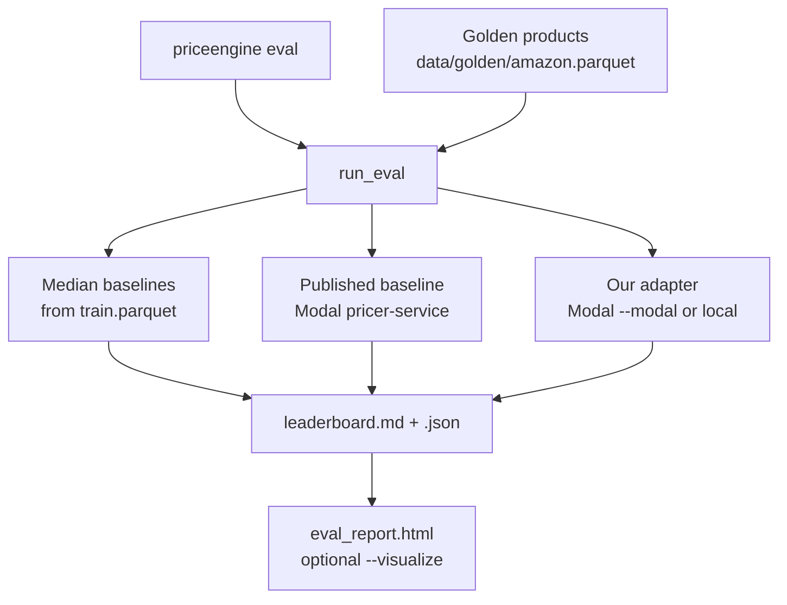

# Evaluation

How this repo **checks** whether a fine-tuned price model is any good.

You do not need deep LLM background to follow this page. Fine-tuning teaches the
model; **eval** is the exam. Same questions for every student (the golden set),
scored the same way. Implementation lives under `src/priceengine/eval/`.

## What “eval” means here

| Idea | In this project |
|------|-----------------|
| **Golden set** | Products held out of training: `data/golden/amazon.parquet` |
| **Pricer** | Anything that takes a product and returns a dollar guess |
| **Prediction** | One guess vs the true list price (`estimate`, `actual`, `error`) |
| **Leaderboard** | Table of average errors for each pricer |
| **Victory** | Our adapter beats the published baseline by enough, on the same items |

We always score **naive floors** (category / overall median of train prices —
no neural net) so a “smart” model that loses to “guess the median” is easy to
spot. Optionally score **frontier APIs** (`--frontier gpt-5`) and always
(default) the **published specialist** for the real comparison.

## Why eval before you publish

1. Keep a **fixed golden set** (do not retune on it).
2. Run **automatic metrics** (MAE, hit rate, paired compare).
3. **Spot-check** failures in the HTML report (wrong categories, truncated text).
4. Only then publish a Hub tag ([`PUBLISH.md`](PUBLISH.md)).

Skipping eval and shipping the first training run is how silent regressions land
in other apps that load your adapter.

## Fair comparison vs `ed-donner/price-2025-11-28`

To claim we beat the published Amazon specialist, give every model the **same**
held-out products, the **same** prompt shape, and (for the official claim) the
**same** 4-bit Modal scoring style. Compare dollar errors **item by item**
(paired), not two unrelated averages.

1. **Same base model:** `meta-llama/Llama-3.2-3B`.
2. **Same serve path (for claims):** 4-bit NF4, double quant, bf16 compute,
   `set_seed(42)`, `max_new_tokens=5`, parse the number after `Price is $`.
3. **Same prompt:** question + product text + `Price is $`.
4. **Same golden items:** `data/golden/amazon.parquet` for every row on the board.
5. **Paired bootstrap** on per-item absolute errors for ΔMAE
   (`Settings.bootstrap_samples`, default 10_000).

**Victory** requires both:

1. Relative MAE improvement ≥ **25%**:
   `(mae_baseline − mae_challenger) / mae_baseline ≥ 0.25`
2. Paired bootstrap 95% CI lower bound on ΔMAE is **&gt; 0**

Implemented in `metrics.paired_compare` / `Settings.victory_relative_mae`.

Local laptop scoring without `--modal` is allowed for smoke tests; it is **not**
the fairness path above.

## Code map

| Step | Function / module |
|------|-------------------|
| CLI | `priceengine eval` → `run_eval` |
| Orchestration | [`eval/run.py`](../src/priceengine/eval/run.py) |
| Median baselines | `SameCategoryMedianPricer`, `OverallMedianPricer` in `pricers.py` (labels: *Naive floor · …*) |
| Frontier APIs | `FrontierChatPricer` via `--frontier gpt-5` (needs `OPENAI_API_KEY`) |
| Published baseline | `PublishedBaselinePricer` → Modal app `pricer-service` |
| Our adapter (fair) | `score_challenger_on_modal` → `modal_score.score_prompts_with_adapter` |
| Our adapter (smoke) | `score_challenger_locally` → `FineTunedPricer` |
| Metrics | `metrics.summarize`, `metrics.paired_compare` |
| Reports | `write_leaderboard`, `write_eval_html` |



## How `run_eval` walks the code

```text
run_eval
  1. load_golden_items
  2. score_median_baselines
  3. load_or_score_published_baseline   # skip with --no-include-baseline
  4. score_frontier_models              # optional --frontier gpt-5
  5. score_challenger_adapter           # only if --adapter-path
  6. compare_to_baseline                # if challenger + specialist/frontier present
  7. write_leaderboard
  8. write_eval_html                    # if --visualize
```

### Honest note: `--modal` vs local scoring

| Mode | What happens | Use for |
|------|----------------|---------|
| `--modal` | Adapter scored on Modal GPU in **4-bit**, same style as the published baseline | Claims / publish decisions |
| no `--modal` | Adapter loaded on your laptop (`load_in_4bit=False` for macOS/MPS) | Quick smoke checks |

Local and Modal numbers can differ slightly. Prefer `--modal` when you say you
beat `ed-donner/price-2025-11-28`.

## Metrics (plain language)

Each product produces an absolute dollar **error** = `|estimate − actual|`.

| Metric | Meaning |
|--------|---------|
| **MAE** | Average dollar error (lower is better) |
| **Median APE** | Typical % error (less skewed by expensive outliers) |
| **Hit rate** | Share of items “close enough”: error &lt; $40 **or** &lt; 20% of the true price (from `Settings`) |
| **RMSLE** | Log-scale error (penalizes relative mistakes across cheap and expensive items) |

**Paired comparison** (challenger vs published baseline on the **same** item ids):
positive ΔMAE means we are closer on average; victory also needs the 25% relative
gain and a CI that stays positive (see [Fair comparison](#fair-comparison-vs-ed-donnerprice-2025-11-28)).

The HTML report does **not** change those numbers; it helps you **read** mistakes.

## Artifacts

| File | Contents |
|------|----------|
| `reports/leaderboard.md` | Human-readable table + paired comparison line |
| `reports/leaderboard.json` | Raw predictions (also caches baseline for the next run) |
| `reports/eval_report.html` | Charts / worst misses (`--visualize`) |
| `reports/eval_report-vX.Y.Z.html` | Same report with `--report-version vX.Y.Z` |

## Prerequisites

```bash
uv run priceengine prepare-data --size lite
# Needs data/golden/amazon.parquet and data/splits/train.parquet
```

Train parquet is required even if you only care about the neural model: median
baselines are built from it.

## Commands

```bash
# Sanity: naive floors + published baseline only
uv run priceengine eval \
  --golden data/golden/amazon.parquet \
  --limit 100 \
  --out reports/leaderboard.md

# Full story: our adapter + GPT-5 + specialist + naive floors
uv sync --extra frontier   # once; needs OPENAI_API_KEY in .env
uv run priceengine eval --modal \
  --adapter-path /data/checkpoints/list_price_qlora \
  --name list_price_qlora \
  --frontier gpt-5 \
  --limit 100 \
  --visualize --report-version v0.1.0 \
  --out reports/leaderboard.md

# Fair challenger score + HTML (no frontier API)
uv run priceengine eval --modal \
  --adapter-path /data/checkpoints/list_price_qlora \
  --name list_price_qlora \
  --limit 100 \
  --visualize --report-version v0.1.0 \
  --out reports/leaderboard.md

# Faster iteration without calling the published baseline again
uv run priceengine eval --modal \
  --adapter-path /data/checkpoints/list_price_qlora \
  --no-include-baseline
```

### CLI options you will use most

| Option | Default | Role |
|--------|---------|------|
| `--golden` | `data/golden/amazon.parquet` | Exam questions |
| `--limit` | `100` | How many items (`0` = all) |
| `--adapter-path` | empty | Our checkpoint (Modal volume path with `--modal`) |
| `--name` | folder name | Label on the leaderboard |
| `--frontier` | empty | OpenAI model id(s), e.g. `gpt-5` (repeatable) |
| `--modal` | off | Fair GPU scoring |
| `--no-include-baseline` | off | Skip published baseline |
| `--visualize` | off | Write HTML |
| `--report-version` | empty | Version the HTML filename |
| `--out` | `reports/leaderboard.md` | Where to write the table |

## How to read results (practical)

1. **Beat the naive floors** — if not, fix data/prompt/serve before tuning LoRA.
2. **Compare MAE to the published specialist and frontier APIs** — paired
   comparison lines in `leaderboard.md` (and the victory rules above).
3. **Open the HTML** — start at the ranked table; check worst misses for
   truncation or odd categories, not “need more epochs.”
4. **Increase `--limit`** before you publish; a lucky 50-item smoke is not a claim.

Align `--name`, training YAML `name:`, `--report-version`, and Hub `--tag` for
each kept run ([`TRAINING.md`](TRAINING.md)).

## Related

- [`TRAINING.md`](TRAINING.md) — train → eval loop
- [`PUBLISH.md`](PUBLISH.md) — Hub adapters after a clean eval
- [`DESIGN.md`](DESIGN.md) — system boundaries
- [`MODEL_CARD.md`](MODEL_CARD.md) — intended use
