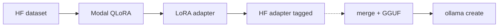

# Ollama consumer path (optional)

## Read this first

| | |
|--|--|
| **Where we train** | Modal + Hugging Face QLoRA ([`TRAINING.md`](TRAINING.md)) |
| **Source of truth** | Tagged PEFT adapter on Hub ([`PUBLISH.md`](PUBLISH.md)) |
| **What this doc is** | Optional *export* so local Ollama apps can run the same weights |
| **What this doc is not** | Instructions to fine-tune inside Ollama |



## Prerequisites

1. A trained adapter (Modal volume or Hub revision from [`PUBLISH.md`](PUBLISH.md)).
2. Enough disk/RAM to merge LoRA into fp16 (~6–7 GB for Llama-3.2-3B).
3. [llama.cpp](https://github.com/ggerganov/llama.cpp) `convert_hf_to_gguf.py`
   (or an equivalent converter).
4. [Ollama](https://ollama.com) installed locally.

## Export stub

This repo ships a helper that writes a `Modelfile` and prints the merge/GGUF
commands. Full GPU merge + conversion is left to your machine (or a future
Modal job):

```bash
uv run priceengine export-ollama \
  --adapter-path /path/to/adapter \
  --out-dir artifacts/ollama \
  --gguf-name list-price-qlora.gguf
```

Then follow the printed steps (merge → convert → `ollama create`).

## Modelfile template

See [`training/ollama/Modelfile`](../training/ollama/Modelfile). After you have a
GGUF on disk:

```bash
cd artifacts/ollama
# Edit FROM to your .gguf path if needed
ollama create list-price -f Modelfile
ollama run list-price
```

Prompt the model with the same list-price format used in training:

```text
What does this cost to the nearest dollar?

<title + description>

Price is $
```

## What we do *not* do

- Fine-tune inside Ollama
- Treat Hub GGUF as the source of truth (the PEFT adapter is)
- Auto-upload GGUF in CI (manual / optional Hub file upload after convert)
- Replace Modal/HF training with an Ollama-first workflow
