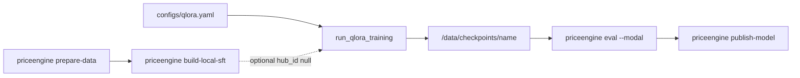
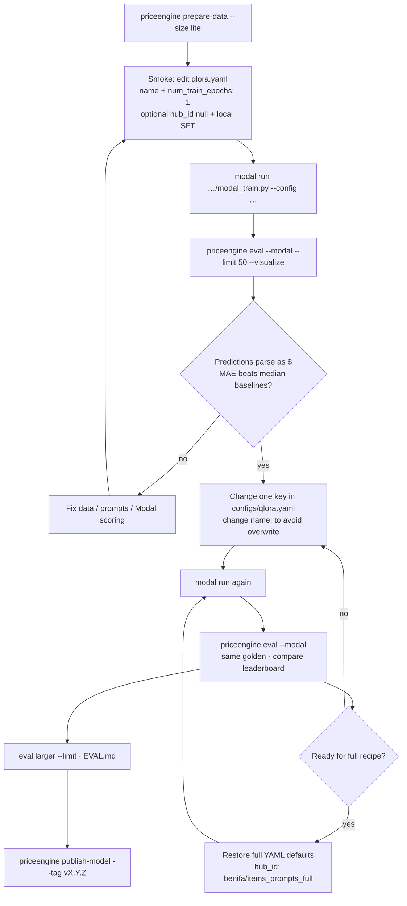

# Training — list-price QLoRA

This document describes **this repository’s** training path: config keys in
[`configs/qlora.yaml`](../configs/qlora.yaml), the Modal job in
[`src/priceengine/train/modal_train.py`](../src/priceengine/train/modal_train.py),
optional local prompt build in
[`src/priceengine/train/local_sft.py`](../src/priceengine/train/local_sft.py),
and eval/publish via the `priceengine` CLI.

## Goal

Fine-tune `meta-llama/Llama-3.2-3B` so it continues the prompt ending in
`Price is $` with a whole-dollar Amazon list price (`NNN.00`, range $1–$999).

Implemented as **QLoRA** (4-bit base + LoRA adapter) on Modal. The saved artifact
is a PEFT adapter under `/data/checkpoints/{name}/` on the Modal volume
`price-engine-data` — not a full new base model.

## Code map

| Piece | Location |
|-------|----------|
| Hyperparameters | `configs/qlora.yaml` |
| Modal train entry | `modal_train.py`: `main` → `run_qlora_on_a100` / `run_qlora_on_a10g` → `run_qlora_training` |
| Prompt constants | `src/priceengine/config.py` (`PRICE_QUESTION`, `PRICE_PREFIX`, `MAX_DESCRIPTION_TOKENS`) |
| Prompt builders | `src/priceengine/prompts.py` (`list_price_prompt`, `price_completion`, `training_example`) |
| Local prompt build | `local_sft.build_local_sft` / `prompt_completion_rows_from_products` + CLI `build-local-sft` |
| Eval | `priceengine eval` → `src/priceengine/eval/run.py` |
| Publish | `priceengine publish-model` → `src/priceengine/train/publish.py` |



## Data: Hub prompts vs local fallback

Training needs rows with columns `prompt` and `completion`. Loading is
`load_train_and_val_prompts` in `modal_train.py`:

1. If `dataset.hub_id` is set → `load_prompts_from_hub` (default:
   `benifa/items_prompts_full`).
2. If `hub_id` is `null`/empty, or Hub load raises →
   `load_prompts_from_local_volume` (`dataset.local_dir`, default `/data/hf_dataset`).

| Source | How it is produced | Used by |
|--------|--------------------|---------|
| `benifa/items_prompts_full` | Prebuilt Hub DatasetDict (`prompt`, `completion`) | Default train path |
| `benifa/items_lite` / `items_full` | Product tables | `prepare-data` → `data/splits/`, `data/golden/` |
| `data/hf_dataset/` | `prepare-data` then `build-local-sft` | Fallback when Hub prompts unavailable |

Local build (`build_local_sft` → `prompt_completion_rows_from_products`) reads
`data/splits/{train,val,test}.parquet`, truncates description text with the Llama
tokenizer at `cutoff` (default `MAX_DESCRIPTION_TOKENS` = 110), and writes a
DatasetDict to `data/hf_dataset/` with splits `train` / `validation` / `test`.

Important: Modal reads **`/data/hf_dataset` on the Modal volume**, not your laptop
disk. After `build-local-sft`, copy that folder onto volume path
`dataset.local_dir` before training with `hub_id: null`.

```bash
uv run priceengine prepare-data --size lite
uv run priceengine build-local-sft
# Sync data/hf_dataset → Modal volume /data/hf_dataset, then set hub_id: null
```

## Prompt contract (code)

Constants in `config.py` / builders in `prompts.py`:

```text
What does this cost to the nearest dollar?

{product text}

Price is $
```

Completion from `price_completion(price)`:

```text
64.00
```

- Labels clamped to [$1, $999] in `data/prepare.py` (`clamp_usd_price`).
- Training YAML: `training.completion_only: true` → TRL `completion_only_loss`
  (loss on the price tokens only).
- `token_budget.max_seq_length: 128` → `SFTConfig.max_length`.

## How `run_qlora_training` works

Laptop only spawns the job; GPU work runs on Modal.

```text
modal run …/modal_train.py --config configs/qlora.yaml
  main() reads YAML
    → run_qlora_on_a100.spawn / run_qlora_on_a10g.spawn
         │
         ▼  (Modal GPU)
  run_qlora_training(config_yaml)
    1. maybe_start_wandb
    2. load_quantized_base_model
    3. load_train_and_val_prompts   # Hub or volume hf_dataset
    4. build_lora_adapter_config
    5. build_sft_trainer_args
    6. SFTTrainer.train → save_adapter_checkpoint
```

GPU choice: `modal.gpu` in YAML. Values starting with `A100` select
`run_qlora_on_a100`; otherwise `run_qlora_on_a10g`.

### Snapshot (same names as the source)

```python
# modal_train.py — run_qlora_training (simplified)
base_model, tokenizer = load_quantized_base_model(train_config)
train_prompts, val_prompts = load_train_and_val_prompts(train_config)

trainer = SFTTrainer(
    model=base_model,
    args=build_sft_trainer_args(...),
    train_dataset=train_prompts,
    eval_dataset=val_prompts,
    peft_config=build_lora_adapter_config(train_config),
    processing_class=tokenizer,
)
trainer.train()
save_adapter_checkpoint(trainer, tokenizer, adapter_checkpoint_dir)
```

## Default recipe (`configs/qlora.yaml`)

| YAML key | Default | Consumed in |
|----------|---------|-------------|
| `name` | `list_price_qlora` | Checkpoint dir `/data/checkpoints/{name}` |
| `base_model` | `meta-llama/Llama-3.2-3B` | `load_quantized_base_model` |
| `hub_model_id` | `null` | Optional `push_to_hub` after train (no revision tag) |
| `dataset.hub_id` | `benifa/items_prompts_full` | `load_prompts_from_hub` |
| `dataset.local_dir` | `/data/hf_dataset` | `load_prompts_from_local_volume` |
| `dataset.val_split` | `val` | Hub val split name |
| `dataset.val_size` | `1000` | Cap on val rows |
| `modal.gpu` | `A100-40GB` | `run_qlora_on_a100` vs `run_qlora_on_a10g` |
| `quantization.*` | 4-bit NF4 double quant, bf16 compute | `BitsAndBytesConfig` |
| `lora.r` / `lora_alpha` | `256` / `512` | `LoraConfig` |
| `lora.lora_dropout` | `0.1` | `LoraConfig` |
| `lora.target_modules` | q/k/v/o + gate/up/down | `LoraConfig` |
| `training.num_train_epochs` | `3` | `SFTConfig` |
| `training.per_device_train_batch_size` | `256` | `SFTConfig` |
| `training.gradient_accumulation_steps` | `1` | `SFTConfig` |
| `training.learning_rate` | `1.0e-4` | `SFTConfig` |
| `training.lr_scheduler_type` | `cosine` | `SFTConfig` |
| `training.warmup_ratio` | `0.01` | `SFTConfig` |
| `training.optim` | `paged_adamw_32bit` | `SFTConfig` |
| `training.max_grad_norm` | `0.3` | `SFTConfig` |
| `training.weight_decay` | `0.001` | `SFTConfig` |
| `training.completion_only` | `true` | `completion_only_loss` |
| `training.group_by_length` | `true` | Applied only if TRL `SFTConfig` still accepts it |
| `token_budget.max_seq_length` | `128` | `SFTConfig.max_length` |
| `early_stop.enabled` | `false` | `EarlyStoppingCallback` when true and val exists |
| `early_stop.patience` | default `3` in code | Callback patience |
| `early_stop.metric` | default `eval_loss` | Must be `eval_loss` or `loss` |
| `wandb.enabled` | `false` | `maybe_start_wandb` + `report_to` |

## Iterative training workflow

Training is iterative: change YAML, retrain, score with `priceengine eval`, compare
`reports/leaderboard.*`. Keep fair-compare constraints in [`EVAL.md`](EVAL.md)
stable while tuning.



### Phase 0 — Smoke validation

Confirm the pipeline before a full A100 run (800k × 3 epochs).

| Step | Actual command / edit |
|------|------------------------|
| 1 | `uv run priceengine prepare-data --size lite` → `data/golden/amazon.parquet` |
| 2 | Copy or edit YAML: set `name:` (e.g. `list_price_qlora_smoke`), `training.num_train_epochs: 1`. For a small dataset, run `build-local-sft`, sync to Modal `/data/hf_dataset`, set `dataset.hub_id: null`. |
| 3 | `uv run modal run --detach src/priceengine/train/modal_train.py --config configs/qlora.yaml` |
| 4 | `uv run priceengine eval --modal --adapter-path /data/checkpoints/<name> --name <name> --limit 50 --visualize` |

If predictions are not valid dollars or medians win, fix prepare/prompt/Modal scoring
before changing `lora.r`.

### Phase 1 — Hyperparameter iteration

Change **one** YAML key (or a tightly coupled pair such as `lora.r` + `lora_alpha`),
set a new `name:` so checkpoints do not overwrite, retrain, re-eval with the same
`--limit` and golden path.

| Observation | YAML keys to adjust | Notes tied to this code |
|-------------|---------------------|-------------------------|
| Train loss barely decreases | `training.learning_rate`, `training.num_train_epochs` | Logged every `training.logging_steps` |
| Train loss ↓, golden MAE ↑ | ↓ `learning_rate`, ↑ `lora.lora_dropout`, ↓ epochs | Overfitting; use `eval --visualize` worst misses |
| Val loss rises after improving | `early_stop.enabled: true` (optional `patience`) | Requires a val split; metric must be `eval_loss` |
| CUDA OOM on Modal | ↓ `per_device_train_batch_size`, ↑ `gradient_accumulation_steps` | Keeps effective batch similar |
| Hard cases wrong in HTML | Inspect truncation / categories in report | Prefer data/prompt fixes over LR |
| Close to category-median baseline | ↑ `lora.r` (keep `lora_alpha ≈ 2 × r`), or more epochs | More adapter capacity |
| Loss spikes | ↓ `learning_rate`, check `training.max_grad_norm` | Default warmup `0.01` |

Leave unchanged while comparing to the published baseline: prompt strings in
`config.py` / `prompts.py`, price clamp [$1, $999], `token_budget.max_seq_length`,
`training.completion_only`, and `base_model`.

### Phase 2 — Full training and publish

1. Restore full defaults in `configs/qlora.yaml` (`hub_id: benifa/items_prompts_full`,
   epochs `3`, batch `256`, LoRA `256`/`512`).
2. `modal run --detach …/modal_train.py --config configs/qlora.yaml`.
3. `priceengine eval --modal --adapter-path /data/checkpoints/<name> --limit … --visualize --report-version vX.Y.Z`.
4. Apply victory rules in [`EVAL.md`](EVAL.md) (fair comparison section).
5. `priceengine publish-model --adapter-path <local adapter dir> --tag vX.Y.Z`.

Prefer `publish-model` over YAML `hub_model_id`: publish creates a revision tag and
model card; `hub_model_id` is an optional untagged private push at end of train.

### Success criteria

1. Beat same-category / overall median pricers from `eval/pricers.py`.
2. Improve MAE vs `ed-donner/price-2025-11-28` on `data/golden/amazon.parquet`
   (see `EVAL.md` / `Settings.victory_relative_mae`).
3. Prefer stable paired-bootstrap results over a short `--limit 50` spike.

Align `name`, `--report-version`, and Hub `--tag` for each kept run.

### Operational notes

- Change `name:` per experiment; adapters write to `/data/checkpoints/{name}/`.
- One YAML change per run.
- Keep the YAML that produced a published tag.
- `wandb.enabled: true` only logs if `WANDB_API_KEY` is present in the Modal
  runtime environment (`maybe_start_wandb`). The default Modal secret is
  `huggingface-secret` only — add a W&B secret if you want cloud logging.
- Smoke on lite local SFT is cheaper than full Hub 800k; full claims should use
  `benifa/items_prompts_full`.

## Commands

Prereqs: Modal + secret `huggingface-secret` (`HF_TOKEN`); local `HF_TOKEN` for
tokenizer/Hub during eval and publish.

```bash
uv run priceengine prepare-data --size lite

uv run modal run --detach src/priceengine/train/modal_train.py \
  --config configs/qlora.yaml

uv run priceengine eval --modal \
  --adapter-path /data/checkpoints/list_price_qlora \
  --name list_price_qlora \
  --limit 100 \
  --visualize --report-version v0.1.0 \
  --out reports/leaderboard.md

uv run priceengine publish-model \
  --adapter-path ./path/to/downloaded/adapter \
  --tag v0.1.0 --private
```

`--detach` keeps the Modal job alive after the local process exits.
`main(wait=True)` / `--wait` blocks until training finishes.

Published baseline scoring uses Modal app `pricer-service` unless you pass
`--no-include-baseline` or reuse predictions from `reports/leaderboard.json`.

## Related

- [`DESIGN.md`](DESIGN.md) — system boundaries
- [`EVAL.md`](EVAL.md) — eval commands, fair comparison, victory math
- [`PUBLISH.md`](PUBLISH.md) — versioned Hub adapters
- [`MODEL_CARD.md`](MODEL_CARD.md) — intended use
